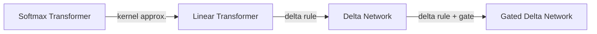

# Reference

 - [GDN's first author, Songlin Yang's blog](https://sustcsonglin.github.io/blog/2024/deltanet-1/)
 - [GATED DELTA NETWORKS : IMPROVING MAMBA 2 WITH DELTA RULE](https://arxiv.org/pdf/2412.06464)
 - [Parallelizing Linear Transformers with the Delta Rule over Sequence Length](https://arxiv.org/pdf/2406.06484)

# Softmax attention -> GDN

### Softmax Attention

Forward Training Form: $O = Softmax(QK^T)V\in\mathbb{R}^{L \times d}$
Inference Form: $o = \sum\limits_{i=1}^t\frac{exp(q_t^Tk_i)}{\sum\limits_{j=1}^texp(q_t^Tk_j)}v_i\in\mathbb{R}^{d}$

where
 - $Q, K, V, O\in\mathbb{R}^{L \times d}$ is the query, key, value, output matrix
 - $L$ is the input sequence length
 - $d$ is the head dimension
### Linear Attention
Linear attention just removes the softmax function from softmax attention

Training Form: $O = QK^TV\in\mathbb{R}^{L \times d}$
Inference Form: $o = \sum\limits_i^{t}(q_t^Tk_i)v_i\in\mathbb{R}^{d}$
### Delta Net

### Gated Delta Net

# Hardware Improvement Discussion
- in linear attention, why using state format improve the computation from $O(L^2d) \to O(Ld^2)$?
- Why Linear Attention improve the hardware performance compared to softmax attention?

<!--stackedit_data:
eyJoaXN0b3J5IjpbNjI3ODU5MzU4XX0=
-->