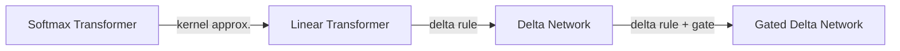

# Reference

 - [GDN's first author, Songlin Yang's blog](https://sustcsonglin.github.io/blog/2024/deltanet-1/)
 - [GATED DELTA NETWORKS : IMPROVING MAMBA 2 WITH DELTA RULE](https://arxiv.org/pdf/2412.06464)
 - [Parallelizing Linear Transformers with the Delta Rule over Sequence Length](https://arxiv.org/pdf/2406.06484)

# Softmax attention -> GDN

### Softmax Attention

Forward Training Form: $O = Softmax(QK^T)V\in\mathbb{R}^{L \times d}$
Inference Form: $o = \sum\limits_{i=1}^t\frac{exp(q_t^Tk_i)}{\sum\limits_{j=1}^texp(q_t^Tk_j)}v_i\in\mathbb{R}^{d}$

where
 - $Q, K, V, O\in\mathbb{R}^{L \times d}$ is the query, key, value, output matrix
 - $L$ is the input sequence length
 - $d$ is the head dimension
### Linear Attention
Linear attention just removes the softmax function from softmax attention

Training Form: $
$$
O = QK^T\top V\in\mathbb{R}^{L \times d}
$$
Inference Form: $o = \sum\limits_i^{t}(q_t^Tk_i)v_i\in\mathbb{R}^{d}$ (row vector format, directly developed from Training form)
$$
\mathbf{o_t} = \sum_{i=1}^{t}(\mathbf{q}_t\mathbf{k}_i^\top)\mathbf{v}_i^\top\in\mathbb{R}^{d}
$$
Inference Form (column vector format, a more conventional expression)
$$
\mathbf{o_t} = \sum\limits_{i=1}^{t}(\mathbf{q}_t^\top \mathbf{k}_i)\mathbf{v}_i\in\mathbb{R}^{d}
$$

Let's develop the **state matrix** of the linear attention using inference form (column format).
$$
\begin{aligned}
&&&& \mathbf{o_t} = \sum_{i=1}^{t}(\mathbf{k}_i^\top \mathbf{q}_t)\mathbf{v}_i, &&&& \mathbf{q}_t^\top \mathbf{k}_i = \mathbf{k}_i^\top \mathbf{q}_t\in\mathbb{R}
\\&&&&=\sum_{j=1}^{t}\mathbf{v}_i(\mathbf{k}_i^\top \mathbf{q}_t)
\\&&&&=\sum_{j=1}^{t}(\mathbf{v}_i\mathbf{k}_i^\top) \mathbf{q}_t &&&&\text{By associativity}
\end{aligned}
$$
We can see that the output token given the $t^{th}$ token, $\mathbf{o_t}$ is the sum of the outer product of $\mathbf{v}_i$ and $\mathbf{k}_i$

### Delta Net
**Delta rule**: the goal of delta rule is to find the correctoptimal weights that correctly predict the output given a input and a target.
```python
import numpy as np
def delta_rule(x, y, epoch = 100, lr = 0.1):
	"""
	x -> [n, d], n is the num of samples, d is the num of features 
	y -> [n,], n is the sample
	"""
	n, d = x.shape
	w =np.zeros(d)
	
	for _ in range(epoch):
		for i in range(n):
			pred = np.dot(x[i], w)
			error = pred - y[i]
			w += lr * error * x[i] # TODO: clarify how delta rule approaches the target 
	
	return w
```
Delta net borrows the concept from delta rule, assuming the target = $v_t$ ($v$ at $t^{th}$ token) and the prediction = $S_{t-1}k_t$ (State matrix at $t-1^{th}$ token, $S_{t-1}$, decoded by $k$ at $k^{th}$ token). This leads to the delta net's formula:

$$
S_t = S_{t-1} + \beta_t(S_{t-1}k_t - v_t)k_t^T
$$

### Gated Delta Net

# Hardware Improvement Discussion
- in linear attention, why using state format improve the computation from $O(L^2d) \to O(Ld^2)$?
- Why Linear Attention improve the hardware performance compared to softmax attention?
# Other Concepts Clarification
- clarify how delta rule approaches the target by updating `w` by `lr * error * x[i]`


<!--stackedit_data:
eyJoaXN0b3J5IjpbLTEyNDE4ODY2MTMsLTI5ODk4MDg4NV19
-->